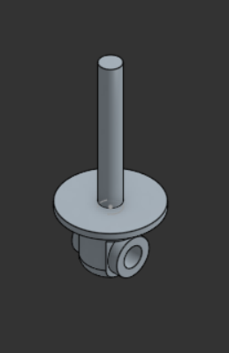
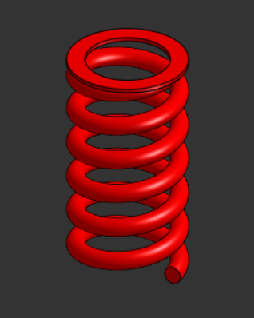
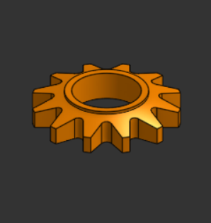
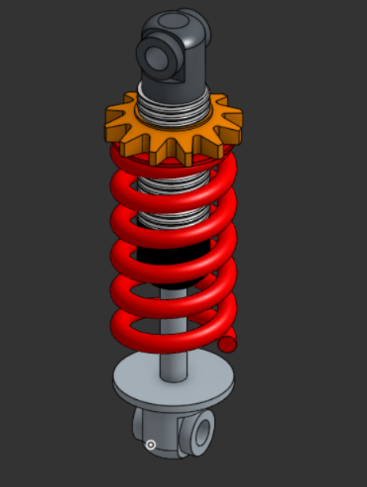

# Suspension Shock Absorber Assembly

This repository contains the design and assembly of a **suspension shock absorber**, created in **Onshape** as part of a mechanical design task. The goal of this project was to practice modeling individual parts and assembling them into a working mechanical system.

---

## Project Overview

The suspension assembly is based on a **spring compression mechanism**. It shows how different mechanical components can be combined to allow controlled vertical movement, similar to suspension systems used in vehicles and robotics.

This project focuses more on understanding the structure and assembly process rather than detailed simulation or analysis.

---

## Components Used

- **the base**  
  Acts as the main support for the assembly and guides the movement.

- **Spring**  
  Allows the system to compress and absorb movement.

- **top rod**  
  Holds the spring in place and allows adjustment.

- **nut**  
  Used to lock or control the position of the assembly.

Each part was modeled separately and then assembled to check fit and alignment.

---

## Design Preview

### base

### Top Rod

### Spring

### Gear / Nut Component

### Full Assembly

---

## Onshape Link

The full CAD model and assembly can be viewed on Onshape using the link below:

👉 [View Suspension Shock Absorber on Onshape](https://cad.onshape.com/documents/fff3b6fc2fc406f99402aa0f/w/2a7a9ca7e3a27b85a9b5d2b3/e/2de455eccbc6b6906f4068d4?renderMode=0&uiState=6988571e108f045695e0d85a)

---

This project was completed for learning purposes and can be improved further by adding motion simulation or integrating it into a larger system.
